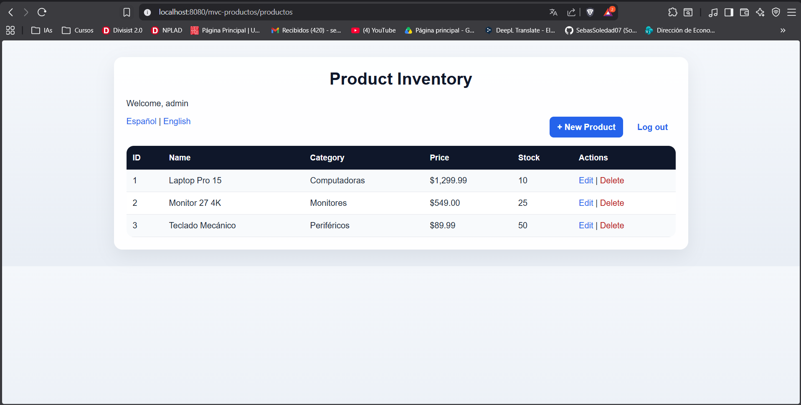
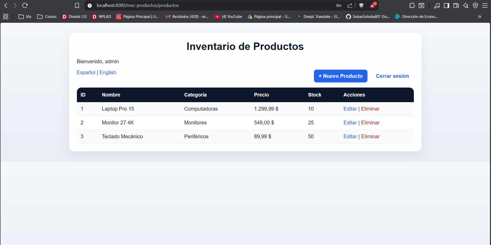
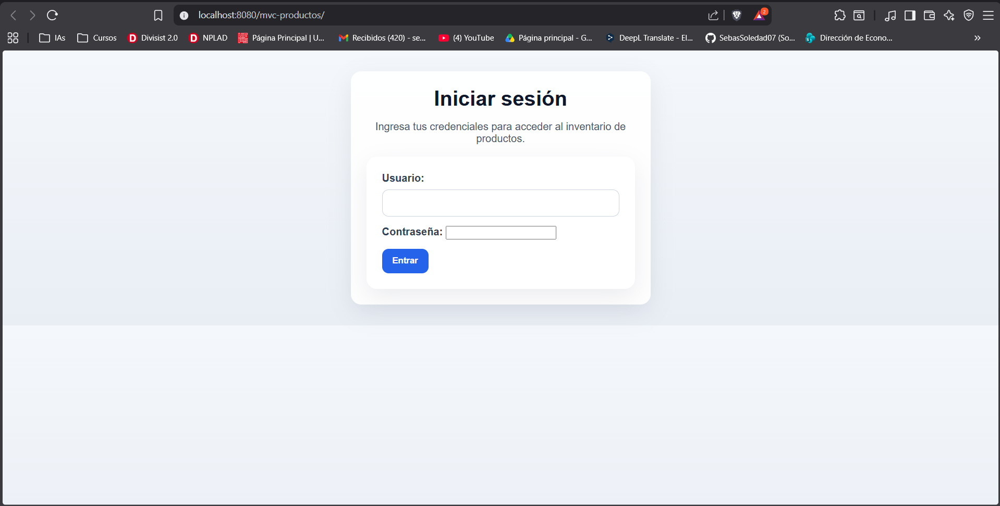

# mvc-productos

## Descripción

Aplicación web ejemplo (modelo MVC) para gestionar un inventario simple de productos. Provee una interfaz JSP + Servlets para crear, listar, editar y eliminar productos en memoria, con inicio de sesión, protección de rutas, internacionalización (es/en), validación de formularios y estilos CSS.

## Prerrequisitos

- Java JDK 8 o superior (el proyecto compila con target 1.8)
- Apache Maven 3.x
- Un contenedor Servlet compatible con Jakarta EE (por ejemplo Apache Tomcat 10+), o usar el WAR generado para desplegar.

## Instalación y ejecución

1. Clona o descarga el repositorio.
2. En la raíz del proyecto (donde está `pom.xml`) compila y empaqueta:

```powershell
mvn clean package -DskipTests
```

3. Despliega el WAR generado `target/mvc-productos.war` en tu contenedor (ej. copia a `tomcat/webapps/`).
4. Abre en el navegador la URL del contexto desplegado. La página de inicio redirige al login (`/login`).

## Credenciales de prueba

- admin / Admin123!  (rol ADMIN)
- viewer / View456! (rol VIEWER)

## Cómo probar rápido en local

- Compila el WAR con Maven (ver arriba).
- Despliega en Tomcat y visita `http://localhost:8080/<context>` (el contexto depende del nombre del WAR o la configuración del servidor). Se redirigirá a `/login`.
- Inicia sesión con las credenciales de prueba.

## Capturas

Las imágenes se incluyen en el repositorio en `docs/capturas/post1` y `docs/capturas/post2`:

- `docs/capturas/post1/lista.png` — Vista del listado de productos
- `docs/capturas/post1/creado.png` — Mensaje de creación exitosa
- `docs/capturas/post1/verifica.png` — Mensaje de verificación / login
- `docs/capturas/post1/actualizar.png` — Producto actualizado
- `docs/capturas/post1/eliminar.png` — Producto eliminado

- `docs/capturas/post2/productos-en.png` — Listado de productos en inglés
- `docs/capturas/post2/productos-es.png` — Listado de productos en español
- `docs/capturas/post2/login.png` — Página de login
Puedes ver las imágenes en el repositorio (ruta relativa mostrada arriba) o copiarlas desde `docs/capturas/post2` al destino que necesites.

### Visualización rápida (post2)








## Funcionalidades implementadas

- Autenticación básica con `LoginServlet` y sesión HTTP (`usuarioActual`).
- Protección de rutas en `ProductoServlet` (verifica sesión al inicio de `doGet`/`doPost`).
- CRUD completo de productos (crear, listar, editar, eliminar) con almacenamiento en memoria (`ProductoDAO`).
- Validación server-side en `ProductoServlet` con repoblado del formulario y mensajes de error por campo (`formulario.jsp`).
- Internacionalización (i18n): `messages.properties` (en) y `messages_es.properties` (es), selector de idioma por `IdiomaServlet`.
- Interfaz JSP con JSTL/Formatting (`lista.jsp`, `formulario.jsp`, `login.jsp`).
- Estilos CSS responsivos en `src/main/webapp/css/estilos.css`.
- Logout con `LogoutServlet` que invalida la sesión.

## Notas de desarrollo

- El proyecto está pensado como ejemplo didáctico; en producción deberías reemplazar el DAO en memoria por una capa de persistencia real (BD), proteger contraseñas, y usar HTTPS.
- Para cambiar el idioma se usa el endpoint `/idioma?lang=es` o `/idioma?lang=en`; el idioma se guarda en sesión.

## Soporte y extensiones sugeridas

- Añadir manejo de usuarios y roles en persistent storage.
- Integrar un framework CSS (Bootstrap/Tailwind) para acelerar el diseño.
- Añadir pruebas unitarias e integración.

